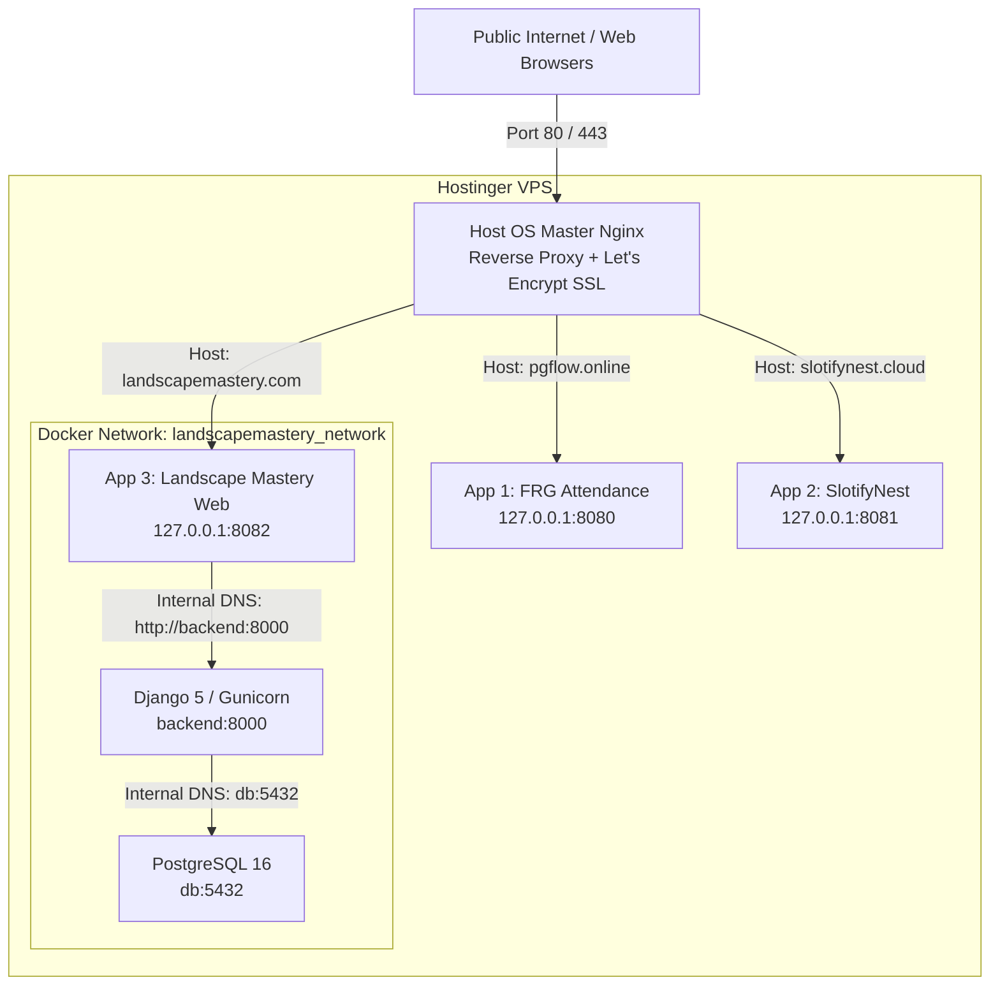

# Production Deployment Guide: Deploying "Landscape Mastery" as the 3rd Web App on a Single Hostinger VPS

> **Target Environment**: Hostinger VPS (Ubuntu 22.04 / 24.04 LTS)  
> **Status**: 2 Existing Web Apps Active (e.g., `pgflow.online`, `slotifynest.cloud`)  
> **Goal**: Deploy **Landscape Mastery** as the 3rd web application, ensuring **all 3 web applications run simultaneously with SSL, zero port conflicts, and 100% stability**.

---

## 1. Executive Architectural Blueprint

When hosting multiple independent web applications on a single VPS, the most common trap is **port collisions** (such as multiple containers trying to bind to host ports `80`, `443`, `8000`, or `5432`) and **reverse proxy clashes** (such as one configuration using `default_server` and intercepting all traffic).

To achieve isolation, stability, and zero downtime across all three applications, we use the **Host Nginx + Dedicated Local Loopback Port** pattern:



### Port Allocation Strategy

| Component | Public Domain | Host External Port | Host Loopback Port (`127.0.0.1`) | Internal Docker Port |
| :--- | :--- | :--- | :--- | :--- |
| **Host Nginx (Master)** | All Domains | `80` (HTTP), `443` (HTTPS) | N/A | Host Service |
| **App 1 (Attendance / PGflow)** | `pgflow.online` | None (closed) | `127.0.0.1:8080` | `8080` (or `80`) |
| **App 2 (SlotifyNest / Other)** | `slotifynest.cloud` | None (closed) | `127.0.0.1:8081` | `8081` (or `80`) |
| **App 3 (Landscape Mastery Web)** | `landscapemastery.com` | None (closed) | **`127.0.0.1:8082`** | `80` (Internal Nginx) |
| **App 3 (Backend API)** | Routed via `/api/` | None (closed) | None (Internal only) | `8000` (Gunicorn) |
| **App 3 (PostgreSQL)** | None | None (closed) | None (Internal only) | `5432` |

> [!IMPORTANT]
> **Cardinal Rules for Multi-App Single-VPS Deployments:**
> 1. **Never bind Docker containers to `0.0.0.0:80` or `0.0.0.0:443`**: Only the Host OS Nginx binds to public ports 80 and 443.
> 2. **Never expose `5432:5432` or `8000:8000` to the host**: Internal containers communicate across their private Docker bridge network using service names (`db:5432`, `backend:8000`).
> 3. **Never use `default_server` in an app-specific Nginx config**: Every website config must match its explicit `server_name domain.com www.domain.com;`.

---

## 2. Phase 1 — VPS Resource Audit & OOM Protection

Running 3 full-stack applications (3x PostgreSQL, 3x Django/Node backends, 3x frontends, plus Redis/Celery) on a single VPS requires memory management. If RAM is exhausted, the Linux **Out-Of-Memory (OOM) Killer** will abruptly kill PostgreSQL or Gunicorn.

### Step 1.1: SSH into your Hostinger VPS
```bash
ssh root@<YOUR_HOSTINGER_VPS_IP>
```

### Step 1.2: Check Existing Memory & Active Ports
```bash
# 1. Check RAM and Swap
free -h

# 2. Check currently used listening ports on the host
sudo ss -tulpn | grep -E ':(80|443|3000|5432|8000|8080|8081|8082)'

# 3. Check currently running docker containers
docker ps --format "table {{.Names}}\t{{.Ports}}\t{{.Status}}"
```

### Step 1.3: Enable Swap Memory (Crucial for 3 Web Apps)
If `free -h` shows `Swap: 0B` or less than 2GB, create a **4GB swapfile** immediately. This provides a safety cushion during `docker build` and traffic spikes:

```bash
# Check if swapfile already exists
if ! swapon --show | grep -q "/swapfile"; then
    echo "Creating 4GB Swapfile..."
    fallocate -l 4G /swapfile || dd if=/dev/zero of=/swapfile bs=1M count=4096
    chmod 600 /swapfile
    mkswap /swapfile
    swapon /swapfile
    echo '/swapfile none swap sw 0 0' >> /etc/fstab
    echo "vm.swappiness=10" >> /etc/sysctl.conf
    sysctl -p
    echo "Swapfile successfully created and activated."
else
    echo "Swap is already active."
fi

# Verify
free -h
```

---

## 3. Phase 2 — Preparing Landscape Mastery for Production

In Landscape Mastery, the frontend container already includes a production-grade Nginx configuration that serves the compiled React SPA and proxies `/api/` and `/media/` to `http://backend:8000`.

Therefore:
- The **frontend** only needs to expose **`127.0.0.1:8082:80`** to the VPS host.
- The **backend** and **database** do **NOT** need any ports published to the host.

### Step 2.1: Clone Landscape Mastery on the VPS
```bash
cd /opt
# Clone the repository (or pull latest changes if already cloned)
git clone <YOUR_LANDSCAPE_MASTERY_GITHUB_REPO_URL> landscapemastery
cd /opt/landscapemastery
```

### Step 2.2: Create Dedicated `docker-compose.prod.yml`
Inside `/opt/landscapemastery/docker-compose.prod.yml`, create the multi-app production configuration:

```yaml
services:
  db:
    image: postgres:16-alpine
    container_name: landscapemastery_db
    restart: unless-stopped
    environment:
      POSTGRES_DB: landscapemastery
      POSTGRES_USER: postgres
      POSTGRES_PASSWORD: ${DB_PASSWORD}
    volumes:
      - landscapemastery_postgres_data:/var/lib/postgresql/data
    networks:
      - landscapemastery_net
    healthcheck:
      test: ["CMD-SHELL", "pg_isready -U postgres -d landscapemastery"]
      interval: 5s
      timeout: 5s
      retries: 5

  backend:
    build:
      context: ./backend
      dockerfile: Dockerfile
    container_name: landscapemastery_backend
    restart: unless-stopped
    env_file:
      - .env.production
    environment:
      - DB_ENGINE=django.db.backends.postgresql
      - DB_NAME=landscapemastery
      - DB_USER=postgres
      - DB_PASSWORD=${DB_PASSWORD}
      - DB_HOST=db
      - DB_PORT=5432
    volumes:
      - landscapemastery_media:/app/media
    depends_on:
      db:
        condition: service_healthy
    networks:
      - landscapemastery_net
    healthcheck:
      test: ["CMD", "python", "-c", "import urllib.request; urllib.request.urlopen('http://localhost:8000/api/health/')"]
      interval: 10s
      timeout: 5s
      retries: 5
      start_period: 20s

  frontend:
    build:
      context: ./frontend
      dockerfile: Dockerfile
      args:
        # Same-origin routing: internal nginx proxies /api/ to backend:8000
        - VITE_API_BASE_URL=""
    container_name: landscapemastery_frontend
    restart: unless-stopped
    ports:
      # Expose ONLY on localhost port 8082 (prevents any external or port collision)
      - "127.0.0.1:8082:80"
    depends_on:
      backend:
        condition: service_healthy
    networks:
      - landscapemastery_net

networks:
  landscapemastery_net:
    driver: bridge

volumes:
  landscapemastery_postgres_data:
  landscapemastery_media:
```

> [!TIP]
> Notice how every container name and volume is prefixed with `landscapemastery_`. This prevents Docker from conflating volumes or networks with App 1 (`pgflow`) or App 2 (`slotifynest`).

### Step 2.3: Generate Secure `.env.production` File
Generate a 64-character cryptographic key and create `/opt/landscapemastery/.env.production`:

```bash
# Generate secure JWT / Django secret
SECRET_KEY=$(python3 -c "import secrets; print(secrets.token_urlsafe(50))")
DB_PASS=$(python3 -c "import secrets; print(secrets.token_hex(16))")

cat <<EOF > /opt/landscapemastery/.env.production
# --- Security & Core ---
DEBUG=False
JWT_SECRET=${SECRET_KEY}
SECRET_KEY=${SECRET_KEY}

# --- Host & Domains ---
# Replace your-domain.com with your actual Landscape Mastery domain
ALLOWED_HOSTS=landscapemastery.com,www.landscapemastery.com,127.0.0.1,localhost,backend,frontend
CORS_ALLOWED_ORIGINS=https://landscapemastery.com,https://www.landscapemastery.com
CSRF_TRUSTED_ORIGINS=https://landscapemastery.com,https://www.landscapemastery.com
FRONTEND_URL=https://landscapemastery.com

# --- Database ---
DB_PASSWORD=${DB_PASS}
DB_CONN_MAX_AGE=600

# --- Payment Gateway (Razorpay) ---
RAZORPAY_KEY_ID=your_razorpay_key_id_here
RAZORPAY_KEY_SECRET=your_razorpay_key_secret_here

# --- Email Notifications ---
EMAIL_HOST=smtp.gmail.com
EMAIL_PORT=587
EMAIL_USE_TLS=True
EMAIL_HOST_USER=your_email@gmail.com
EMAIL_HOST_PASSWORD=your_app_password
DEFAULT_FROM_EMAIL=Landscape Mastery <noreply@landscapemastery.com>
CONTACT_NOTIFICATION_EMAIL=admin@landscapemastery.com
EOF

chmod 600 /opt/landscapemastery/.env.production
```

---

## 4. Phase 3 — DNS Records & Hostinger Firewall

Before issuing SSL certificates, your domain name must point to your Hostinger VPS IP address.

### Step 3.1: Domain DNS Records
Log into your DNS provider (e.g. Hostinger, GoDaddy, Namecheap, or Cloudflare) and set:

| Type | Name / Host | Target / Value | TTL |
| :--- | :--- | :--- | :--- |
| **A** | `@` | `<YOUR_HOSTINGER_VPS_IP>` | Auto / 300s |
| **A** | `www` | `<YOUR_HOSTINGER_VPS_IP>` | Auto / 300s |

Verify DNS propagation from your terminal:
```bash
dig +short landscapemastery.com
# Should return your Hostinger VPS IP
```

### Step 3.2: Hostinger VPS Firewall Rules
Ensure the Hostinger Cloud Firewall only exposes standard web ports:
- **Port 22** (SSH)
- **Port 80** (HTTP)
- **Port 443** (HTTPS)

*(Do NOT open 8000, 8080, 8081, 8082, or 5432 to the public internet).*

---

## 5. Phase 4 — Build & Start Landscape Mastery Containers

Now launch Landscape Mastery without touching the other running web apps.

```bash
cd /opt/landscapemastery

# 1. Build and start containers in the background
docker compose -f docker-compose.prod.yml up -d --build

# 2. Verify containers are healthy
docker compose -f docker-compose.prod.yml ps
```

You should see:
- `landscapemastery_db` — Up (healthy)
- `landscapemastery_backend` — Up (healthy)
- `landscapemastery_frontend` — Up, `127.0.0.1:8082->80/tcp`

### Step 4.1: Create Django Super Admin
```bash
docker compose -f docker-compose.prod.yml exec backend python manage.py createsuperuser
```
Follow prompts to enter username, email, and password.

### Step 4.2: Verify Internal Response Locally on the VPS
Run a curl command on the VPS host to ensure the app answers on `127.0.0.1:8082`:
```bash
curl -I http://127.0.0.1:8082/
# Expected: HTTP/1.1 200 OK

curl http://127.0.0.1:8082/api/health/
# Expected: {"status":"healthy","database":"connected"}
```

---

## 6. Phase 5 — Host Nginx Master Reverse Proxy Configuration

Now connect `landscapemastery.com` to `127.0.0.1:8082` through the **Host Nginx** service.

### Step 5.1: Review Existing Sites (Do Not Overwrite!)
Check existing configs in `/etc/nginx/sites-available/` and `/etc/nginx/sites-enabled/`:
```bash
ls -la /etc/nginx/sites-enabled/
```
You should see configuration files for App 1 and App 2 (e.g. `pgflow_attendance.conf` and `slotifynest.conf`).

> [!CAUTION]
> If any existing config has `listen 80 default_server;` or `server_name _;`, it will hijack traffic meant for `landscapemastery.com`. Ensure existing configs specify their domain (e.g. `server_name pgflow.online www.pgflow.online;`).

### Step 5.2: Create Dedicated Nginx Block for Landscape Mastery
Create `/etc/nginx/sites-available/landscapemastery.conf`:

```bash
cat << 'EOF' > /etc/nginx/sites-available/landscapemastery.conf
# =========================================================================
# Application 3: Landscape Mastery Reverse Proxy
# =========================================================================

server {
    listen 80;
    listen [::]:80;
    server_name landscapemastery.com www.landscapemastery.com;

    # Allow large media/video uploads
    client_max_body_size 100M;

    # Proxy all traffic to Landscape Mastery frontend container
    location / {
        proxy_pass http://127.0.0.1:8082;
        proxy_http_version 1.1;

        proxy_set_header Host $host;
        proxy_set_header X-Real-IP $remote_addr;
        proxy_set_header X-Forwarded-For $proxy_add_x_forwarded_for;
        proxy_set_header X-Forwarded-Proto $scheme;

        # WebSocket support
        proxy_set_header Upgrade $http_upgrade;
        proxy_set_header Connection "upgrade";

        # Timeouts for long video processing/requests
        proxy_connect_timeout 60s;
        proxy_send_timeout 120s;
        proxy_read_timeout 120s;
    }
}
EOF
```

### Step 5.3: Enable the Configuration & Validate Syntax
```bash
# 1. Symlink to sites-enabled
ln -sf /etc/nginx/sites-available/landscapemastery.conf /etc/nginx/sites-enabled/landscapemastery.conf

# 2. Test syntax without reloading (Critical: verifies no conflicts with other apps)
sudo nginx -t
```

If `nginx -t` reports `syntax is ok` and `test is successful`:
```bash
# 3. Reload Nginx (Seamless zero-downtime reload for App 1 and App 2)
sudo systemctl reload nginx
```

---

## 7. Phase 6 — Automated SSL/TLS with Let's Encrypt (Certbot)

Now secure `landscapemastery.com` with free SSL certificates via Certbot:

```bash
# Install certbot if not already present
sudo apt update && sudo apt install -y certbot python3-certbot-nginx

# Obtain and install SSL for Landscape Mastery
sudo certbot --nginx -d landscapemastery.com -d www.landscapemastery.com
```

Certbot will:
1. Verify domain ownership over port 80.
2. Generate certificates in `/etc/letsencrypt/live/landscapemastery.com/`.
3. Automatically update **only** `/etc/nginx/sites-available/landscapemastery.conf` with HTTPS redirection and SSL parameters.
4. Reload Nginx without modifying App 1 or App 2 certificates.

### Verify Auto-Renewal
```bash
sudo certbot renew --dry-run
```

---

## 8. Phase 7 — Comprehensive 3-App Verification Checklist

Verify that **all three web applications** function properly side-by-side:

### 1. HTTP/HTTPS Status Verification
Run these from any terminal or check in a browser:
```bash
# Test App 1 (FRG Attendance)
curl -I https://pgflow.online

# Test App 2 (SlotifyNest)
curl -I https://slotifynest.cloud

# Test App 3 (Landscape Mastery)
curl -I https://landscapemastery.com
curl -I https://www.landscapemastery.com
```
All three should return `HTTP/2 200` or appropriate `301/302` redirects.

### 2. Functional Landscape Mastery Verification
- [ ] **Health Endpoint**: Visit `https://landscapemastery.com/api/health/` -> confirms `{"status":"healthy","database":"connected"}`.
- [ ] **SPA Routing**: Visit `https://landscapemastery.com/courses` or reload sub-routes -> confirm 200 OK without 404 fallback issues.
- [ ] **Django Admin**: Visit `https://landscapemastery.com/admin/` -> log in with your superuser credentials.
- [ ] **Media Uploads**: Upload a course image or banner and verify it loads over HTTPS.
- [ ] **Payments (Razorpay)**: Trigger a checkout test order.

### 3. Server Resource & Container Health
```bash
# Check all running containers across all 3 apps
docker ps --format "table {{.Names}}\t{{.Status}}\t{{.Ports}}"

# Check real-time RAM and CPU consumption
docker stats --no-stream
```

---

## 9. Day-2 Maintenance & CI/CD Operations

### Updating Landscape Mastery Without Affecting Other Apps
Whenever you push updates to GitHub for Landscape Mastery:
```bash
cd /opt/landscapemastery
git pull origin main
docker compose -f docker-compose.prod.yml up -d --build
```
This updates only the Landscape Mastery containers; App 1 and App 2 remain completely undisturbed.

### View Logs for Landscape Mastery
```bash
# Backend logs
docker compose -f docker-compose.prod.yml logs -f --tail=100 backend

# Frontend logs
docker compose -f docker-compose.prod.yml logs -f --tail=100 frontend

# Database logs
docker compose -f docker-compose.prod.yml logs -f --tail=50 db
```

---

## 10. Troubleshooting & Conflict Resolution Matrix

| Symptom | Root Cause | Exact Fix |
| :--- | :--- | :--- |
| `bind: address already in use: 0.0.0.0:80` or `5432` | A container in `docker-compose.yml` is attempting to bind directly to a host port already taken by Host Nginx or another Postgres instance. | Ensure `db` has **no published ports**. Ensure `frontend` binds **only** to `127.0.0.1:8082:80`. |
| `502 Bad Gateway` on `landscapemastery.com` | `landscapemastery_frontend` container is stopped or restarting. | Run `docker compose -f docker-compose.prod.yml ps`. Check logs via `docker compose -f docker-compose.prod.yml logs frontend`. |
| Visiting `landscapemastery.com` displays App 1 or App 2 | Host Nginx has an old catch-all `default_server` directive. | Check `/etc/nginx/sites-enabled/`. Remove `default_server` from App 1/2 configs so each site requires its exact `server_name`. Run `nginx -t && systemctl reload nginx`. |
| `DisallowedHost at /` | `landscapemastery.com` is missing from Django's `ALLOWED_HOSTS`. | Edit `.env.production`, add your domain to `ALLOWED_HOSTS`, and run `docker compose -f docker-compose.prod.yml restart backend`. |
| `CSRF verification failed` on admin login | Domain is missing from `CSRF_TRUSTED_ORIGINS`. | Edit `.env.production`, add `https://landscapemastery.com` to `CSRF_TRUSTED_ORIGINS`, and restart `backend`. |
| Containers randomly exiting with Code 137 | Linux OOM (Out Of Memory) killer killed container due to lack of RAM. | Ensure 4GB Swap is active (`free -h`). Follow Section 1.3 to activate Swap space immediately. |
